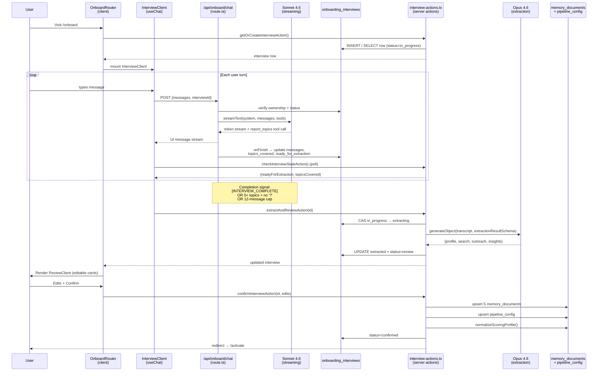

# Onboarding Interview Architecture

How the AI career-coach interview works end-to-end in GTM Command Center — from the moment the user lands on `/onboard` to the point where their profile, pipeline config, scoring weights, and outreach style are persisted and the autonomous pipeline can start running.

---

## 1. The big picture

The interview is not a form with AI sprinkled on top. It's a **streaming conversation** backed by a small state machine in Postgres, with a second "extraction" pass by a stronger model that converts the transcript into the structured records the rest of the app needs.

Three models of persistence work together:

| Layer                                       | What lives here                                                                                                                 | Why                                                                            |
| ------------------------------------------- | ------------------------------------------------------------------------------------------------------------------------------- | ------------------------------------------------------------------------------ |
| `onboarding_interviews` row                 | Raw UIMessages, `topics_covered`, `status`, extracted JSON                                                                      | Source-of-truth for an interview session — survives refresh, disconnect, retry |
| `memory_documents`                          | Final markdown blobs (`user_profile`, `user_positioning`, `user_dealbreakers`, `feedback_outreach_style`, `interview_insights`) | Long-lived narrative context for downstream prompts (scoring, drafting)        |
| `pipeline_config` + `user_scoring_profiles` | Structured fields (search queries, locations, threshold, scoring weights)                                                       | Machine-readable knobs the pipeline reads every run                            |

The interview row is ephemeral-ish (one active at a time per user). The memory docs and config are permanent.

---

## 2. The state machine

An `onboarding_interviews` row walks through five statuses:

```
┌────────────┐    user sends messages    ┌────────────┐
│ in_progress│ ────────────────────────▶ │ in_progress│
└─────┬──────┘   (streaming loop)        └──────┬─────┘
      │                                          │
      │  [INTERVIEW_COMPLETE] marker OR         │
      │  5+ topics + no trailing '?' OR         │
      │  12-message hard cap                    │
      │                                          ▼
      │                                   ┌────────────┐
      │   extractAndReviewAction()        │ extracting │
      └─────────────────────────────────▶ └──────┬─────┘
                                                 │ Opus JSON
                                                 ▼
                                          ┌────────────┐
                                          │   review   │ ◀── user edits cards
                                          └──────┬─────┘
                                                 │ confirmInterviewAction()
                                                 ▼
                                          ┌────────────┐
                                          │ confirmed  │
                                          └────────────┘

                  (any stage)
                      │ abandonInterviewAction()
                      ▼
                ┌───────────┐
                │ abandoned │
                └───────────┘
```

Status transitions are **atomic compare-and-set** (see `interview-actions.ts:139`) — two concurrent callers can't both run extraction.

---

## 3. End-to-end sequence



---

## 4. Phase-by-phase walkthrough

### Phase A — Entry and routing

- `src/app/(app)/onboard/page.tsx` is the server entry. It calls `getOrCreateInterviewAction()` so the page always has an interview row (active or newly created).
- `OnboardRouter` (`_components/onboard-router.tsx`) picks one of three modes:
  - **`choice`** — first-time user sees "AI interview" vs. "manual wizard"
  - **`interview`** — mounts `InterviewClient`
  - **`manual`** — mounts `OnboardClient` (the legacy step-by-step form)
- If the row is already in `review`, it jumps straight to `ReviewClient`.
- If the row is `in_progress` but `ready_for_extraction=true` (server finished the interview while the client was disconnected), it auto-fires extraction on mount — see `onboard-router.tsx:63-78`.

### Phase B — The streaming interview

This is the heart of the system. Files involved:

- `src/app/api/onboard/chat/route.ts` — the streaming endpoint
- `src/lib/onboarding/interview-prompt.ts` — system prompt + `report_topics` tool
- `src/app/(app)/onboard/_components/interview-client.tsx` — chat UI with `useChat`

**Client side** (`useChat` from `@ai-sdk/react`):

- `DefaultChatTransport` posts to `/api/onboard/chat` with `{ messages, interviewId }`.
- The chat ID is the `interviewId`, so messages resume across refresh.
- Initial messages come from `interview.messages` if present, otherwise a hard-coded opening line.

**Server side** (`route.ts`):

1. `requireUser()` + verify ownership + verify status is `in_progress` (404/400 otherwise).
2. **Hard cap at 12 assistant messages** — if already at the cap, skips generation, writes `ready_for_extraction=true`, and returns 200.
3. At assistant message ≥10, it **injects a wrap-up instruction** into the system prompt telling the model to close out on this turn.
4. `streamText({ model: claude-sonnet-4-6, system, messages, tools: interviewTools, maxOutputTokens: 1024 })`.
5. Response is `toUIMessageStreamResponse({ originalMessages, onFinish })`.

**The `report_topics` tool** (the key design trick):

```ts
report_topics: tool({
  description:
    "After every response, report which interview topics have been sufficiently covered so far.",
  inputSchema: z.object({
    covered: z.array(
      z.enum([
        "identity",
        "career",
        "proof_points",
        "tools",
        "search_prefs",
        "dealbreakers",
        "outreach_style",
      ]),
    ),
  }),
  execute: async ({ covered }) => ({ covered }),
});
```

The tool has no real side effect — its purpose is to force the model to declare topic coverage **in a structured way we can parse server-side**. In `onFinish`, the route walks every assistant message, finds all `report_topics` tool-UI parts, unions their `covered` arrays, and writes that set to `topics_covered`. The UI reads that column to show the progress pills.

### Phase C — Completion detection

Three independent paths set `ready_for_extraction=true`:

1. **Explicit marker** — the model outputs `[INTERVIEW_COMPLETE]` on its own line in the last assistant message. Primary path — taught in the system prompt.
2. **Heuristic fallback** — if ≥5 topics are covered and the last assistant message contains no `?`, treat it as a wrap-up. Catches the case where the model softens the marker away.
3. **Hard cap** — 12 assistant messages, no argument.

All three update the same flag. The client polls `checkInterviewStateAction` after each stream completes; when it flips, the client calls `extractAndReviewAction`.

### Phase D — Extraction (Opus pass)

`extractAndReviewAction` in `interview-actions.ts`:

1. **Atomic claim** — `UPDATE ... WHERE status='in_progress' RETURNING id`. Loser refetches and no-ops.
2. Formats the UIMessage array into a plain `Coach: ... / User: ...` transcript.
3. Calls `generateObject` (AI SDK v6, Opus 4.6, 4096 max tokens) with `EXTRACTION_SYSTEM_PROMPT` and `extractionResultSchema` (zod). Schema enforces shape at the boundary; per-field `.default()` calls provide fallbacks when the model omits optional values.
4. Response is typed as `ExtractionResult` (derived via `z.infer`) with four blocks:
   - **`profile`** — positioning, careerHighlights, proofPoints, technicalTools
   - **`search`** — searchQueries, searchLocations, scoreThreshold, dailySendCap
   - **`outreach`** — greenFlags, redFlags, outreachTone, whatsWorked, whatToAvoid
   - **`insights`** — career_narrative, decision_drivers, unstated_preferences, strongest_stories, positioning_alternatives, risk_tolerance, communication_style_notes
5. Writes the four blocks into the unified `extracted` JSONB column and flips status to `review`.
6. On failure, reverts to `in_progress` so the user can retry.

**Why two models?** Sonnet is the right size for fast, warm conversational turns under 1 KB of output. Opus is the right size for a single heavy synthesis pass over the full transcript into structured JSON.

### Phase E — Review and confirm

`ReviewClient` renders editable cards (positioning, career highlights, search queries, dealbreakers, outreach tone…) pre-filled from `interview.extracted`. User edits and hits Confirm.

`confirmInterviewAction` runs **sequential idempotent upserts** (any step can be retried without corruption):

```
1. memory_documents upsert → user_profile + user_positioning
2. pipeline_config upsert → search_queries, locations, threshold, daily_send_cap
3. memory_documents upsert → user_dealbreakers + feedback_outreach_style
4. memory_documents upsert → interview_insights
5. normalizeScoringProfile(svc, user.id) → derives user_scoring_profiles
6. onboarding_interviews.status = 'confirmed'
```

Only after step 6 does `isOnboardingComplete()` return true, which unlocks the redirect to `/activate` and eventually `/`.

---

## 5. Component map

```
┌──────────────────────── /onboard ──────────────────────────┐
│                                                            │
│  page.tsx  ──▶  getOrCreateInterviewAction()              │
│      │                                                     │
│      ▼                                                     │
│  OnboardRouter                                             │
│      │                                                     │
│      ├── mode='choice'   ──▶  Interview vs Manual picker   │
│      │                                                     │
│      ├── mode='interview'──▶  InterviewClient              │
│      │                          │                          │
│      │                          ├── useChat (AI SDK)       │
│      │                          │     │                    │
│      │                          │     └──▶ /api/onboard/chat
│      │                          │              │           │
│      │                          │              ├── streamText(Sonnet)
│      │                          │              └── onFinish → DB
│      │                          │                           │
│      │                          └── checkInterviewStateAction (poll)
│      │                                                     │
│      ├── status='review'   ──▶  ReviewClient               │
│      │                          └── confirmInterviewAction │
│      │                                │                    │
│      │                                ├── memory_documents │
│      │                                ├── pipeline_config  │
│      │                                └── scoring_profiles │
│      │                                                     │
│      └── mode='manual'     ──▶  OnboardClient (legacy wizard)
│                                                            │
└────────────────────────────────────────────────────────────┘
```

---

## 6. Why it's built this way (design notes)

- **Row-per-interview instead of just streaming in memory**: lets the user close the tab and resume, survives the "model finished the wrap-up but client disconnected before extraction" case, and gives us an audit trail if extraction goes weird.
- **`report_topics` as a tool rather than parsed from text**: forces the model to commit to a machine-readable signal every turn. Text parsing would drift; tool schemas don't.
- **Two completion signals + hard cap**: completion is adversarial — the model can forget the marker, the user can rage-quit, the conversation can spiral. Each backstop covers a different failure mode.
- **Atomic CAS on extraction**: double-clicking "continue" or a page revalidation firing twice would otherwise run Opus extraction twice on the same transcript. The CAS makes it idempotent.
- **Idempotent upserts in confirm**: any of the six writes can fail and be retried. Nothing here mutates-in-place — all `upsert({ onConflict: ... })`.
- **Memory docs + config are the public API of the interview**: downstream code (scoring, drafting, activation) never reads `onboarding_interviews`. It reads `memory_documents` and `pipeline_config`. This keeps the interview contract narrow — we can change prompt shape, model, or conversation flow freely without breaking the pipeline.

---

## 7. Key files reference

| File                                                     | Role                                                                                              |
| -------------------------------------------------------- | ------------------------------------------------------------------------------------------------- |
| `src/app/(app)/onboard/page.tsx`                         | Server entry. Creates/loads interview, computes `toClientTemplate()`                              |
| `src/app/(app)/onboard/_components/onboard-router.tsx`   | Mode switching, auto-extract on resume. Threads `clientTemplate` prop down                        |
| `src/app/(app)/onboard/_components/interview-client.tsx` | useChat UI, topic pills from template, state polling                                              |
| `src/app/(app)/onboard/_components/review-client.tsx`    | Editable review cards. Accepts `clientTemplate` prop (render still job_search-specific — Phase 2) |
| `src/app/(app)/onboard/interview-actions.ts`             | Thin server-action wrappers: getOrCreate / extractAndReview / confirm / abandon / backTo          |
| `src/app/(app)/onboard/confirm-logic.ts`                 | `performConfirm(svc, userId, interviewId, edits)` — testable persistence body                     |
| `src/app/api/onboard/chat/route.ts`                      | Streaming endpoint. Reads model / cap / marker / threshold / prompt from the template             |
| `src/lib/onboarding/templates/types.ts`                  | `InterviewTemplate`, `OutputMapping`, `ClientInterviewTemplate`                                   |
| `src/lib/onboarding/templates/job-search.ts`             | `JOB_SEARCH_TEMPLATE` — the one template today. Topics, prompts, schema, outputs co-located       |
| `src/lib/onboarding/templates/index.ts`                  | `getTemplate(id)` / `getDefaultTemplate()` / `toClientTemplate()`                                 |
| `src/lib/onboarding/interview-prompt.ts`                 | Sonnet system prompt + `report_topics` tool (consumed by job_search template)                     |
| `src/lib/onboarding/extraction.ts`                       | `runExtractionFromTranscript(messages, template)` — generateObject + template zod schema          |
| `src/lib/onboarding/extraction-prompt.ts`                | Opus system prompt (consumed by job_search template)                                              |
| `src/lib/pipeline/scoring-profile.ts`                    | `normalizeScoringProfile` — derives structured scoring fields                                     |
| `scripts/test-onboarding-confirm.ts`                     | DB-integration regression test for the confirm path (42 assertions)                               |

---

## 8. Template abstraction

The state machine, streaming loop, CAS locks, and confirm sequence above are **template-agnostic**. The content that varies per interview — prompts, topics, extraction schema, which memory docs to write on confirm — is pulled from an `InterviewTemplate` object loaded by `getTemplate(interview.template_id)`.

### The `InterviewTemplate` interface

```ts
interface InterviewTemplate<E, X> {
  id: InterviewTemplateId; // "job_search" (widens in Phase 2/3)
  version: string; // "v1" — append-only

  // Chat phase (consumed by route.ts)
  systemPrompt: (ctx: { isRefresh; existingProfile? }) => string;
  tools: ToolSet;
  openingMessage: string;
  refreshOpeningMessage: string;
  maxAssistantMessages: number;
  wrapUpThreshold: number;
  completionMarker: string;
  completionTopicThreshold: number;
  chatModel: string;
  chatMaxOutputTokens: number;

  topics: readonly string[];
  topicLabels: Record<string, string>;

  // Extraction phase (consumed by extraction.ts)
  extractionSchema: z.ZodType<X, ZodTypeDef, unknown>;
  extractionSystemPrompt: string;
  extractionModel: string;
  extractionMaxOutputTokens: number;

  // Confirm phase (consumed by confirm-logic.ts)
  editsSchema: z.ZodType<E, ZodTypeDef, unknown>;
  outputs: readonly OutputMapping<E, X>[];
}
```

### `OutputMapping` — the confirm-phase contract

The 6-step hardcoded sequence that used to live in `confirmInterviewAction` is now data: `outputs[]`. Each entry is dispatched by type:

| type                        | payload shape                                 | handler behavior                                                             |
| --------------------------- | --------------------------------------------- | ---------------------------------------------------------------------------- |
| `memory_doc`                | `transform` returns markdown string           | Upsert `memory_documents` with `(user_id, document_key=key, title, content)` |
| `pipeline_config`           | `transform` returns `Record<string, unknown>` | Upsert `pipeline_config` with `{ ...payload, user_id }` (user_id wins)       |
| `scoring_profile_normalize` | no transform                                  | Call `normalizeScoringProfile(svc, userId)`                                  |

Transforms receive `{ edits, extraction }` and may return `null` to skip (e.g. `interview_insights` skips if no insights were extracted). The loop runs in array order; any throw aborts the confirm and leaves the interview in `review` for retry.

### Client-side projection

`InterviewTemplate` can't cross the RSC→Client boundary — zod schemas, tool definitions, and the `systemPrompt` function are not serializable. `toClientTemplate(template)` strips to a plain-data `ClientInterviewTemplate` of `{ id, topics, topicLabels, openingMessage, refreshOpeningMessage }` for the UI.

### Database layout

`onboarding_interviews` has `template_id` + `template_version` columns (defaults `'job_search'`, `'v1'`). The active-interview partial unique index is `(user_id, template_id)` WHERE status IN active states — future templates can have concurrent active interviews for the same user.

Extraction output lands in a single `extracted` JSONB column whose top-level shape is the active template's `extractionSchema`. For `job_search` that's `{ profile, search, outreach, insights }`; future templates declare their own shape. Readers must validate via the active template's schema, not against a global type.

### Known gaps (Phase 1 did not close these)

Flagged here so Phase 2 doesn't re-discover them:

- **`isOnboardingComplete()`** (`src/lib/pipeline/onboarding.ts`) checks 3 hardcoded memory doc keys (`user_profile`, `feedback_outreach_style`) + `pipeline_config` existence. Needs per-template completion criteria.
- **`normalizeScoringProfile()`** reads memory doc sections by name (`Career Highlights`, `Green Flags`, …) that are job_search-specific markdown headings.
- **`ReviewClient`** renders 4 job_search sections. Accepts `clientTemplate` prop but ignores it. Phase 2 switches on `clientTemplate.id`.
- **`review-client.tsx` refresh fallback** (lines ~70–73) reads literal topic names (`search_prefs`, `outreach_style`, `dealbreakers`).
- **`runExtractionFromTranscript` return type** is `Promise<ExtractionResult>` (job_search shape) with an `as ExtractionResult` cast. Genericize on `X` before a second template lands, or callers will get silent type lies.
- **ICP and positioning templates do not exist yet** and have no UI entry point. See `docs/build-spec-gtm-command-center-pivot.md` §8 (ICP) and §9 (positioning rubric) for the extraction schemas, §6 for the Exa-based ICP search adapter.

### Adding a template (Phase 2+ recipe)

1. New file `src/lib/onboarding/templates/<id>.ts` exporting a full `InterviewTemplate` instance.
2. Widen `InterviewTemplateId` in `types.ts`; add the entry to `REGISTRY` in `index.ts`.
3. Route: either `/onboard/<id>/page.tsx` or `/onboard?template=<id>` — pass `templateId` into `getOrCreateInterviewAction`.
4. If the template needs different schema storage, plan the `onboarding_interviews` migration (unified `extracted` column).
5. Fix the known gaps above, at minimum for the dimensions the new template touches.
6. If the template produces a search rubric, build the corresponding adapter (Exa queries for ICP, competitor-URL scorecards for positioning) + any new domain tables (`leads`, `positioning_rubrics`).
